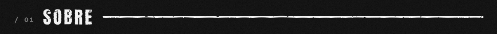
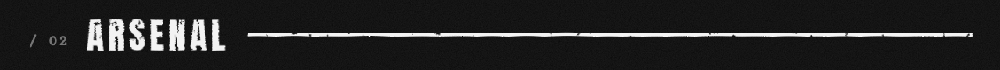
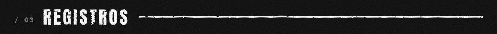

<p align="center">
  
</p>

<p align="center">
  <code>&gt; SEM FRAMEWORK MÁGICO. SEM DEPLOY NA SEXTA. SEM MEDO DO LEGADO.</code>
</p>



```text
NOME .......... GIANDONN
FUNÇÃO ........ DESENVOLVEDOR FULL STACK
BASE .......... BRASIL
EM CAMPO ...... APIs, painéis, apps e tudo que roda no meio disso
DOUTRINA ...... código legível é código livre
STATUS ........ ██████████ EM ATIVIDADE
```



<p align="center">
  
  
  
  
  
  
  <br>
  
  
  
  
  
</p>



<p align="center">
  
</p>

<p align="center">
  
</p>
