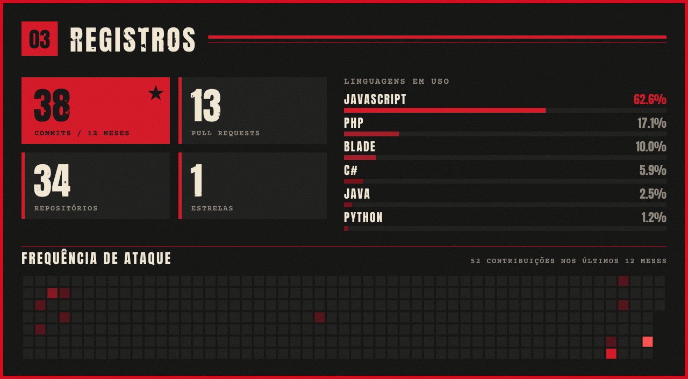

  

  

  

  

  

ícones: <a href="https://fontawesome.com/license/free">Font Awesome</a> (CC BY 4.0) · <a href="https://simpleicons.org">Simple Icons</a> (CC0) · fontes: Anton, Courier Prime (OFL)

