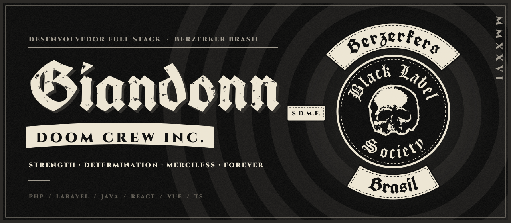
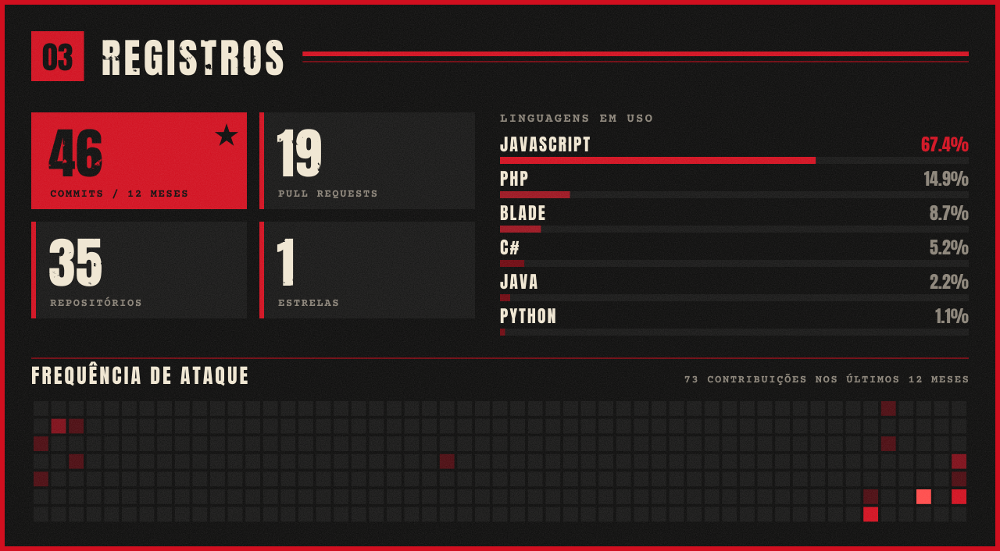
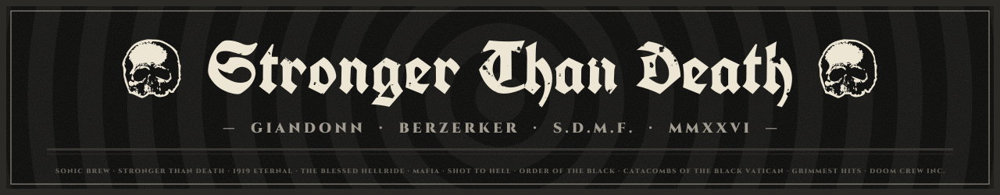

  

  

  

  

  

logo e caveira: <a href="https://www.blacklabelsociety.net">Black Label Society</a> (homenagem de fã) · ícones: <a href="https://fontawesome.com/license/free">Font Awesome</a> (CC BY 4.0) · <a href="https://simpleicons.org">Simple Icons</a> (CC0) · fontes: UnifrakturCook, Cinzel, Anton (OFL)

